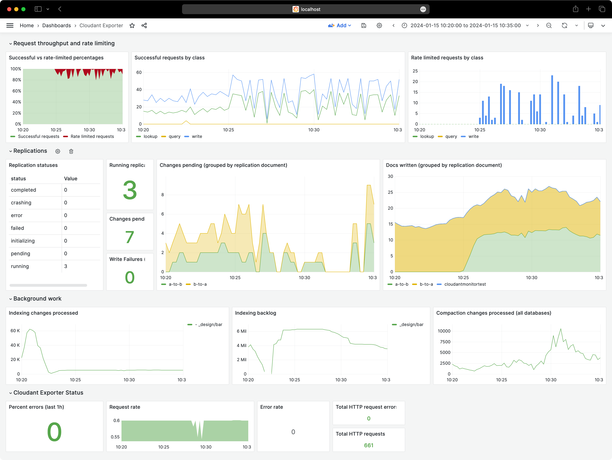

# Cloudant Prometheus Exporter

A simple Cloudant Prometheus client that polls a Cloudant account for
information and publishes them in a Prometheus-consumable format on a `/metrics`
endpoint.



## Configuring

Expects environment variables to be supplied according to
[this documentation](https://cloud.ibm.com/apidocs/cloudant?code=go#authentication-with-external-configuration).
e.g.

```sh
export CLOUDANT_URL="https://myservice.cloudant.com"
export CLOUDANT_APIKEY="my_IAM_API_KEY"
```

## Running locally

```sh
go run ./cmd/cloudant_exporter
```

## Running in Docker

First we turn this repo into a Docker image:

```sh
# build a docker image
docker build -t cloudant_exporter .
```

Then we can can spin up a container, exposing its port `8080` to our port
`8080`:

```sh
# run it with credentials as environment variables
docker run \
  -e CLOUDANT_URL="$CLOUDANT_URL" -e CLOUDANT_APIKEY="$CLOUDANT_APIKEY" \
  -i \
  -p 8080:8080 \
  cloudant_exporter:latest
```

## Running in IBM Code Engine

Assuming you have installed the
[IBM Cloud CLI](https://cloud.ibm.com/docs/cli?topic=cli-install-ibmcloud-cli)
and the
[IBM Code Engine CLI plugin](https://cloud.ibm.com/docs/codeengine?topic=codeengine-cli),
you can deploy `cloudant_exporter` into IBM Code Engine using the command line:

```sh
# create a project
ibmcloud ce project create --name mycloudantexporterproject
# create an application within the project
ibmcloud ce application create \
  --name mycloudantexporter \
  --image ghcr.io/glynnbird/cloudant_exporter:latest \
  --env "CLOUDANT_URL=$CLOUDANT_URL" \
  --env "CLOUDANT_APIKEY=$CLOUDANT_APIKEY" \
  --max 1 --min 1
```

## Running Prometheus locally

[Download Prometheus](https://prometheus.io/docs/prometheus/latest/getting_started/#downloading-and-running-prometheus)
or run `brew install prometheus` on a Mac.

Create a `prometheus.yml` file containing:

```yaml
global:

  external_labels:
    monitor: 'cloudant'

scrape_configs:
  - job_name: 'cloudant'
    scrape_interval: 1m
    static_configs:
      - targets: ['localhost:8080']
```

where `localhost:8080` is the domain and port of your `cloudant_exporter`
application.

Run Prometheus with:

```sh
prometheus --config.file=prometheus.yml
```
